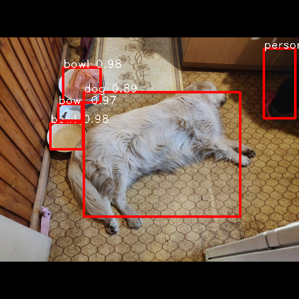

# Yet-Another-YOLOv4-Pytorch


This is implementation of YOLOv4 object detection neural network on pytorch. I'll try to implement all features of original paper.

 - [x] Model
 - [x] Pretrained weights
 - [x] Custom classes
 - [x] CIoU
 - [x] YOLO dataset
 - [x] Letterbox for validation
 - [x] HSV transforms for train
 - [x] MOSAIC for train
 - [x] Dropblock layers for training. After convblock and after residual block. (Thanks to Evgenii Zheltonozhskii for pytorch implementation)
 - [x] LARS optimizer
 - [x] Pytorch lightning
 - [x] Self adversial training
 - [x] SAM attention block from official YOLOv4 paper
 - [x] ECA attention block from https://arxiv.org/abs/1910.03151 with fastglobalavgpool from https://arxiv.org/pdf/2003.13630.pdf
 - [x] Weight standartization from https://arxiv.org/abs/1903.10520 (Do not suggest to use with pretrained, could lead to an input explosion, used with track_running_stats, otherwise explosion)
 - [x] Notebook with guide


## What you can already do
You can use video_demo.py to take a look at the original weights realtime OD detection. (Have 9 fps on my GTX1060 laptop!!!)


You can train your own model with mosaic augmentation for training. Guides how to do this are written below. Borders of images on some datasets are even hard to find.


You can make inference, guide bellow.


## Initialize NN

    #YOU CAN USE TORCH HUB
    m = torch.hub.load("VCasecnikovs/Yet-Another-YOLOv4-Pytorch", "yolov4", pretrained=True)

    import model
    #If you change n_classes from the pretrained, there will be caught one error, don't panic it is ok

    #FROM SAVED WEIGHTS
    m = model.YOLOv4(n_classes=1, weights_path="weights/yolov4.pth")

    #AUTOMATICALLY DOWNLOAD PRETRAINED
    m = model.YOLOv4(n_classes=1, pretrained=True)

## Download weights
You can use torch hub
or you can download weights using from this link: https://drive.google.com/open?id=12AaR4fvIQPZ468vhm0ZYZSLgWac2HBnq

## Initialize dataset

    import dataset
    d = dataset.ListDataset("train.txt", img_dir='images', labels_dir='labels', img_extensions=['.JPG'], train=True)
	path, img, bboxes = d[0]

"train.txt" is file which consists filepaths to image (images\primula\DSC02542.JPG)

img_dir - Folder with images
labels_dir - Folder with txt files for annotion
img_extensions - extensions if images

If you set train=False -> uses letterboxes
If you set train=True -> HSV augmentations and mosaic

dataset has collate_function

    # collate func example
    y1 = d[0]
    y2 = d[1]
    paths_b, xb, yb = d.collate_fn((y1, y2))
	# yb has 6 columns
	
## Y's format
Is a tensor of size (B, 6), where B is amount of boxes in all batch images.
 1. Index of img to which this anchor belongs (if 1, then it belongs to x[1])
 2. BBox class
 3. x center
 4. y center
 5. width
 6. height

## Forward with loss
    y_hat, loss = m(xb, yb)

!!! y_hat is already resized anchors to image size bboxes

## Forward without loss
    y_hat,  _ = m(img_batch) #_ is (0, 0, 0)

## Check if bboxes are correct
    import utils
    from PIL import Image
    path, img, bboxes = d[0]
    img_with_bboxes = utils.get_img_with_bboxes(img, bboxes[:, 2:]) #Returns numpy array
    Image.fromarray(img_with_bboxes)
    
## Get predicted bboxes
    anchors, loss = m(xb.cuda(), yb.cuda())
    confidence_threshold = 0.05
    iou_threshold = 0.5
    bboxes, labels = utils.get_bboxes_from_anchors(anchors, confidence_threshold, iou_threshold, coco_dict) #COCO dict is id->class dictionary (f.e. 0->person)
    #For first img
    arr = utils.get_img_with_bboxes(xb[0].cpu(), bboxes[0].cpu(), resize=False, labels=labels[0])
    Image.fromarray(arr)

## References
In case if you missed:\
Paper Yolo v4: https://arxiv.org/abs/2004.10934\
Original repo: https://github.com/AlexeyAB/darknet#how-to-train-to-detect-your-custom-objects
```
@article{yolov4,
  title={YOLOv4: YOLOv4: Optimal Speed and Accuracy of Object Detection},
  author={Alexey Bochkovskiy, Chien-Yao Wang, Hong-Yuan Mark Liao},
  journal = {arXiv},
  year={2020}
}
```
